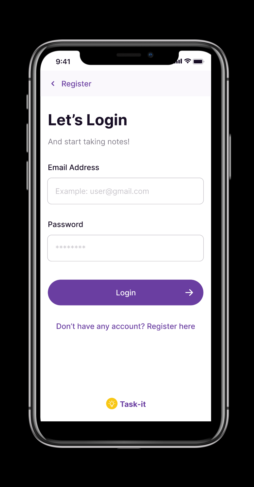
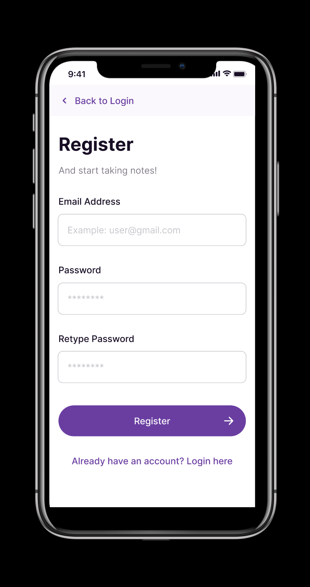
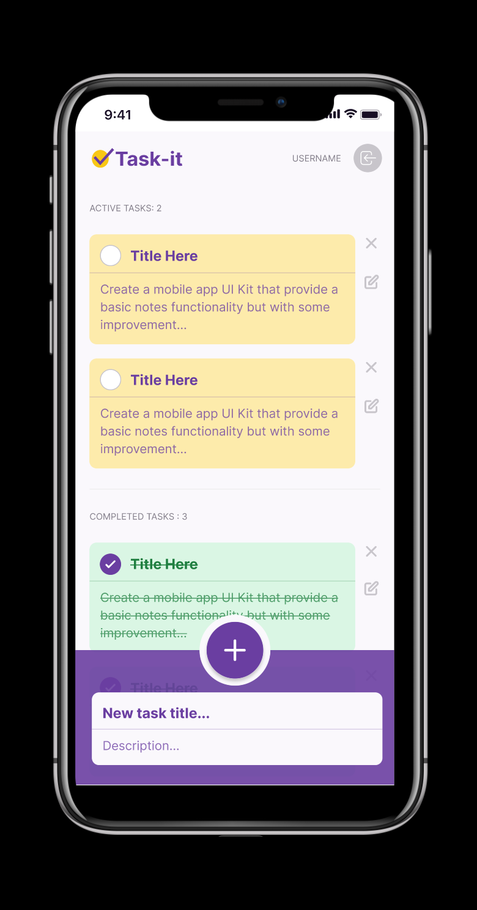

# Task-it app

Task manager app where the user can add, delete, check and create tasks. Also register or login.

Responsive web app running on Vue 3 with the composition API, Pinia as a state management tool, vue router, vite, sweetalert2 and lastly Supabase running on the backend.
     

## Vercel deployment

[Project deployment](https://task-it.vercel.app)

### Figma prototipe

   

[Figma prototipe](<https://www.figma.com/file/q1C07Z615DXy62XvE5zMiE/UI-Kit-(taskit)?node-id=936%3A13105>)

## Project Setup

```sh
npm install
```

## Set Up your Environment Variables from Supabase located at the root folder of the project

```sh
VITE_SUPABASE_URL
VITE_SUPABASE_ANON_KEY
```

### Compile and Hot-Reload for Development

```sh
npm run dev
```

### Compile and Minify for Production

```sh
npm run build
```
