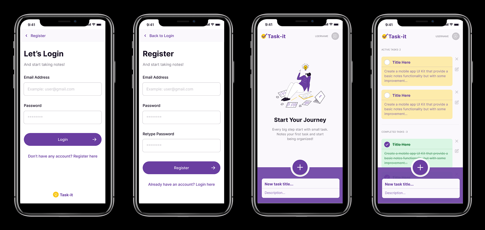

# Task-it app

Task manager app where the user can add, delete, check and create tasks. Also register or login.

Responsive web app running on Vue 3 with the composition API, Pinia as a state management tool, vue router, vite, sweetalert2 and lastly Supabase running on the backend.
     

      

## Vercel deployment

[Project deployment](https://task-it.vercel.app)

### Figma prototipe



[Figma prototipe](<https://www.figma.com/file/q1C07Z615DXy62XvE5zMiE/UI-Kit-(taskit)?node-id=936%3A13105>)

## Project Setup

```sh
npm install
```

## Set Up your Environment Variables from Supabase located at the root folder of the project

```sh
VITE_SUPABASE_URL
VITE_SUPABASE_ANON_KEY
```

### Compile and Hot-Reload for Development

```sh
npm run dev
```

### Compile and Minify for Production

```sh
npm run build
```

### Day 1

Clase de Supabase.
Set up del proyecto.

### Day 2

Entender mejor la premisa del proyecto.
Repasar la logica ya escrita en el proyecto.
Aplicar mejor lo hecho en la tarde anterior.
Planificar en kanban.
Busqueda de inspiración para el diseño.
Crear el template con Figma. https://www.figma.com/file/q1C07Z615DXy62XvE5zMiE/UI-Kit-(taskit)?node-id=936%3A13105
Empezar a aplicar los estilos.

### Day 3

Continuar aplicando los estilos.
Acabados los estilos de Login y Register.
Home estilos casi acabados. Falta arreglar algunas cosas del position del nav, del add new task y el scroll de las tasks.

### Day 4

Arreglar problemillas de los estilos del home.
Hacer que las tasks se puedan borrar y poner como completed.
Log out button funcional.

### Day 5

Poner las tasks ordenadas según Active o completed.
Tasks como completed, arreglar activar/desactivar.
Modify tasks.

### Day 6

Modify tasks hacer-lo funcionar.
Alerta al eliminar tasks.
Alerta al hacer logout.
Deployment en vercel.

### Day 7

Hacer media querys de la versión desktop.

### Day 8

css adaptado a responsive.
css del modify tasks.
Diseñar el email template de confirmación.
Desactivar el botón de modify tasks cuando las tasks estan en completed.
Crear alerta para el log out y eliminar task.

### Day 9

Hacer presentación.
Arreglar mostrar password en Register.
